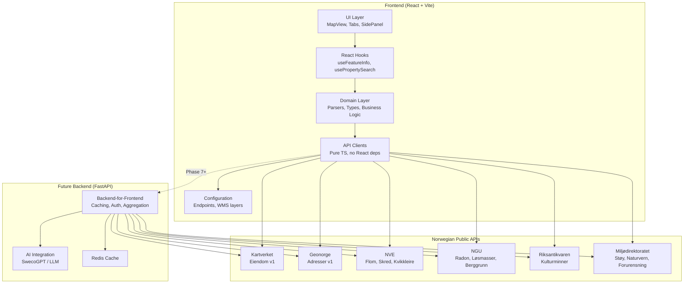
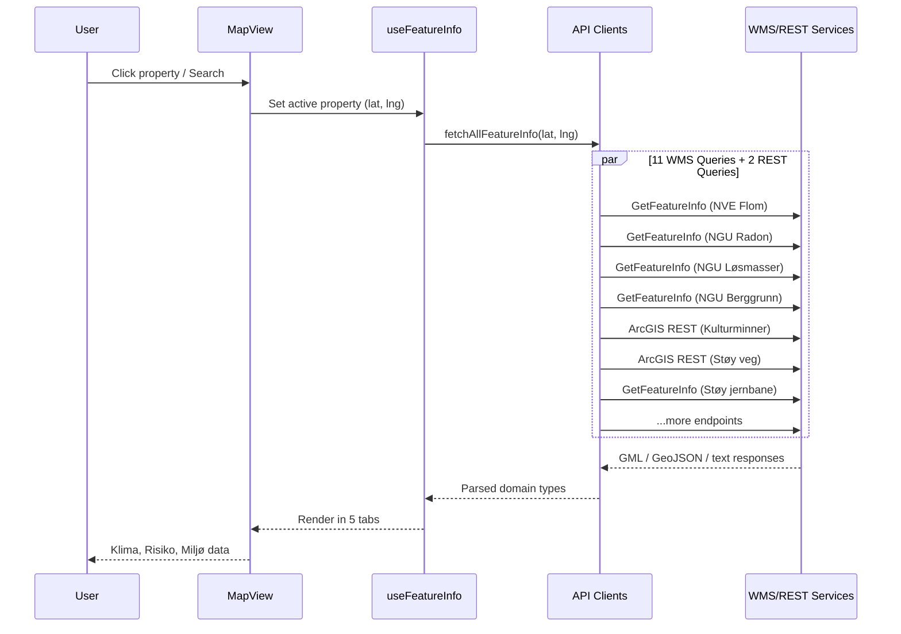

# Proposal: Map Service — Property Analysis Platform

> Build a reusable, portable property map service that aggregates Norwegian geospatial data sources into a unified property analysis experience — designed for eventual backend extraction and AI integration.

## Problem Statement

Sweco's consultants and project teams frequently need to assess properties against multiple geospatial datasets — flood zones, landslide risk, radon, soil conditions, cultural heritage, noise zones, contamination, and zoning plans. Today this requires:

1. **Manual multi-tool workflow**: Consultants open 5–10 separate map portals (NVE, NGU, Riksantikvaren, Miljødirektoratet, Geonorge) and cross-reference data by hand.
2. **No aggregation**: There is no single view showing all risk/environment/climate data for a property.
3. **No comparison**: Comparing properties for site selection requires repeated manual lookups.
4. **Legacy internal tool**: An older Bootstrap-based prototype existed but lacked dark mode, multi-API coverage, modern design system compliance, and had no clear path to backend extraction.

This proposal addresses all four pain points by building a modern, layered property analysis service.

## Stakeholders

| Role           | Name   | Decision  |
| -------------- | ------ | --------- |
| Author         | NOASOL |           |
| Tech Lead      | NOASOL | Accepted  |
| Product Owner  | NOASOL | Accepted  |

## Proposed Solution

A React-based property map service at `/map` that:

1. **Searches** Norwegian properties by address, matrikkel number, or map click
2. **Renders** properties as colour-coded polygons on an interactive Leaflet map
3. **Aggregates** 11+ WMS/REST data sources into a 5-tab analysis panel
4. **Caches** results for batch pre-fetching across selected properties
5. **Exports** data for reports, with a path to PDF generation

### High-Level Architecture

### Data Flow

### Alternatives Considered

| Alternative                       | Pros                                      | Cons                                        |
| --------------------------------- | ----------------------------------------- | ------------------------------------------- |
| Extend old Bootstrap app          | Existing code, familiar to team           | No dark mode, no modern design, poor architecture |
| Use commercial platform (Norkart) | Turnkey solution                          | Vendor lock-in, annual licensing cost, no AI path |
| Backend-only (Python + static UI) | Better API security                       | Slower iteration, needs infra from day 1     |
| **Chosen: Frontend-first, layered** | **Fast iteration, portable domain layer** | **CORS constraints, no API key protection**  |

## Impact Analysis

### Benefits

- **Unified view**: All geospatial risk/environment data in one panel — replaces 5–10 separate portals
- **Instant comparisons**: Multi-property selection with batch pre-fetching
- **Portable architecture**: `api/` and `domain/` layers translate 1:1 to Python/FastAPI
- **Sweco design system**: Full dark/light mode, Tailwind v4, consistent UX
- **AI-ready**: Domain layer produces structured data suitable for LLM context

### Risks

| Risk | Likelihood | Impact | Mitigation |
|------|-----------|--------|------------|
| Public APIs go offline | Medium | High | Graceful degradation per-source, retry with backoff, stale data indicators |
| CORS issues with new WMS sources | Medium | Medium | Test each source upfront; backend proxy as fallback |
| Data accuracy/freshness | Low | High | DataFreshness warnings in UI, source attribution on every row |
| Scope creep (too many sources) | Medium | Medium | Phased approach with clear priority tiers |
| Backend extraction complexity | Low | Medium | Strict layer separation enforced from day 1 |

### Success Metrics

| Metric | Target | Current |
|--------|--------|---------|
| Data sources integrated | 15+ | 11 (WMS) + 2 (REST) |
| Tab coverage | 5 tabs with data | 5/5 tabs functional |
| Batch pre-fetch coverage | All selected properties | ✅ Implemented |
| Time to switch active property | < 200ms (cached) | ✅ Achieved |
| Backend portability | 1:1 translatable | ✅ Design enforced |

## Implementation Plan

See the [continuation prompt](./map-feature-continuation-prompt.md) for detailed per-phase implementation notes.

| Phase | Focus | Status |
|-------|-------|--------|
| Phase 1 | UX/UI Completion (full viewport, search, panel) | ✅ Complete |
| Phase 2 | API & Data Robustness (dual-API, error resilience) | ✅ Complete |
| Phase 3 | Extended Features (WMS layers, screenshot, export) | ✅ Complete |
| Phase 4 | Code Quality (refactoring, tabbed panel, validation) | ✅ Complete |
| Phase 5 | GetFeatureInfo & Tab Data (active property, parsers) | ✅ Complete |
| Phase 6 | Additional Data Sources (grunnforhold, kulturminner, støy, batch) | 🔄 ~60% |
| Phase 7 | Reports, Comparison, Scoring | ⬜ Planned |
| Phase 8 | Backend Extraction (FastAPI) | ⬜ Planned |
| Phase 9 | AI Integration (SwecoGPT) | ⬜ Planned |

## Related Documents

| Type | Title | Status |
|------|-------|--------|
| TAD | [Map Service TAD](../tads/map-service-tad.md) | Living document |
| ADR | [ADR-004: Layered Feature Architecture](../adrs/004-layered-feature-architecture.md) | Accepted |
| ADR | [ADR-005: Config-Driven WMS Integration](../adrs/005-config-driven-wms-integration.md) | Accepted |
| ADR | [ADR-006: GML over Text/Plain for NGU](../adrs/006-gml-over-text-plain-for-ngu.md) | Accepted |
| ADR | [ADR-007: ArcGIS REST for Riksantikvaren and Miljødirektoratet](../adrs/007-arcgis-rest-for-external-services.md) | Accepted |
| ADR | [ADR-008: SafeParse Error Boundary Pattern](../adrs/008-safeparse-error-boundary-pattern.md) | Accepted |
| ADR | [ADR-009: Five-Tab Panel Layout](../adrs/009-five-tab-panel-layout.md) | Accepted |
