# TAD: Map Service — Property Analysis Platform

> Comprehensive technical architecture document for the NO-Ask map service — a property analysis platform aggregating Norwegian geospatial data into a unified, portable, AI-ready experience.

## Overview

The map service (`/map` route) is a React-based geospatial analysis tool that lets users search Norwegian properties and view aggregated data from 13+ public WMS/REST endpoints across 5 analysis tabs. It is designed with strict layer separation to enable future backend extraction (Python/FastAPI) and AI integration (SwecoGPT).

**Key characteristics**:
- 13 parallel API queries per property (11 WMS + 2 ArcGIS REST)
- 5-tab analysis panel (Eiendommer, Generelt, Klima, Risiko, Miljø)
- Batch pre-fetching for all selected properties
- Full dark/light mode with Sweco design system
- Zero backend dependency — all queries run client-side (backend-ready architecture)

## Related Documents

| Type     | Title                                                         | Status       |
| -------- | ------------------------------------------------------------- | ------------ |
| Proposal | [Map Service Proposal](../proposals/map-service-proposal.md)  | In Progress  |
| ADR-004  | [Layered Feature Architecture](../adrs/004-layered-feature-architecture.md) | Accepted |
| ADR-005  | [Config-Driven WMS Integration](../adrs/005-config-driven-wms-integration.md) | Accepted |
| ADR-006  | [GML over Text/Plain for NGU](../adrs/006-gml-over-text-plain-for-ngu.md) | Accepted |
| ADR-007  | [ArcGIS REST for External Services](../adrs/007-arcgis-rest-for-external-services.md) | Accepted |
| ADR-008  | [SafeParse Error Boundary Pattern](../adrs/008-safeparse-error-boundary-pattern.md) | Accepted |
| ADR-009  | [Five-Tab Panel Layout](../adrs/009-five-tab-panel-layout.md) | Accepted |
| Handoff  | [Continuation Prompt](../proposals/map-feature-continuation-prompt.md) | Living |

---

## 1. System Architecture — Current State

### 1.1 Component Architecture

```mermaid
flowchart TD
    subgraph MapPage["MapPageView.tsx — Page Orchestrator"]
        direction TB
        Router["Route Entry<br/>/map"]
    end

    subgraph UILayer["UI Layer"]
        MapView["MapView.tsx<br/>Leaflet Map + Polygons"]
        SidePanel["SidePanel.tsx<br/>Resizable 5-Tab Panel"]
        SearchBar["MapSearchControl.tsx<br/>Floating Search"]
        Screenshot["MapScreenshotControl.tsx<br/>Camera Control"]
        
        subgraph Tabs["Tab Components"]
            Tab1["PropertyTable<br/>Eiendommer"]
            Tab2["GenereltTab<br/>Matrikkel"]
            Tab3["KlimaTab<br/>Flom + Skred + Kvikkleire"]
            Tab4["RisikoTab<br/>Radon + Grunnforhold"]
            Tab5["MiljoTab<br/>Kultur + Støy"]
        end
    end

    subgraph HookLayer["Hook Layer"]
        usePS["usePropertySearch"]
        useMI["useMapInteraction"]
        useFI["useFeatureInfo<br/>+ useBatchFeatureInfo"]
        useExport["useMapExport"]
    end

    subgraph DomainLayer["Domain Layer (Pure TS)"]
        Types["types.ts<br/>Property, Address, LatLng"]
        FITypes["featureInfoTypes.ts<br/>KlimaData, RisikoData, StoyData"]
        Parser["featureInfoParser.ts<br/>15+ parsers + safeParse"]
        Lookup["propertyLookup.ts<br/>3 search flows"]
        MatParse["matrikkelParser.ts"]
    end

    subgraph APILayer["API Layer (Pure TS)"]
        KVClient["kartverketClient.ts"]
        GNClient["geonorgeClient.ts"]
        WMSClient["wmsFeatureInfoClient.ts"]
        KMClient["kulturminnerClient.ts"]
        StoyClient["stoySonerClient.ts"]
        FetchUtil["fetchUtils.ts<br/>retry + backoff"]
    end

    subgraph ConfigLayer["Config Layer"]
        Endpoints["featureInfoEndpoints.ts<br/>11 WMS endpoint configs"]
        WMSLayers["wmsLayers.ts<br/>7 overlay definitions"]
    end

    subgraph StoreLayer["Store Layer (Zustand)"]
        SelStore["propertySelection.store.ts<br/>Persisted selections"]
        FIStore["featureInfo.store.ts<br/>In-memory cache"]
    end

    Router --> MapView & SidePanel
    SidePanel --> Tabs
    MapView --> SearchBar & Screenshot
    
    Tab1 & Tab2 & Tab3 & Tab4 & Tab5 --> useFI
    MapView --> useMI --> usePS
    usePS --> Lookup --> KVClient & GNClient
    useFI --> WMSClient & KMClient & StoyClient
    useFI --> Parser
    WMSClient --> Endpoints
    MapView --> WMSLayers
    
    useMI & useFI --> SelStore & FIStore
    KVClient & GNClient & WMSClient & KMClient & StoyClient --> FetchUtil

    classDef ui fill:#98bddc,stroke:#3a7dbf,color:#000
    classDef hook fill:#87be73,stroke:#538840,color:#000
    classDef domain fill:#de845d,stroke:#874c33,color:#000
    classDef api fill:#c6b37c,stroke:#989077,color:#000
    classDef config fill:#bde3af,stroke:#3f6730,color:#000
    classDef store fill:#d6e4f1,stroke:#293c53,color:#000

    class MapView,SidePanel,SearchBar,Screenshot,Tab1,Tab2,Tab3,Tab4,Tab5 ui
    class usePS,useMI,useFI,useExport hook
    class Types,FITypes,Parser,Lookup,MatParse domain
    class KVClient,GNClient,WMSClient,KMClient,StoyClient,FetchUtil api
    class Endpoints,WMSLayers config
    class SelStore,FIStore store
```

### 1.2 Data Source Integration Map

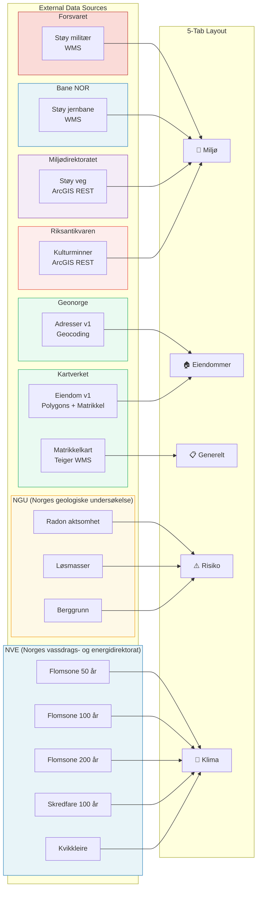

### 1.3 Query Execution Flow

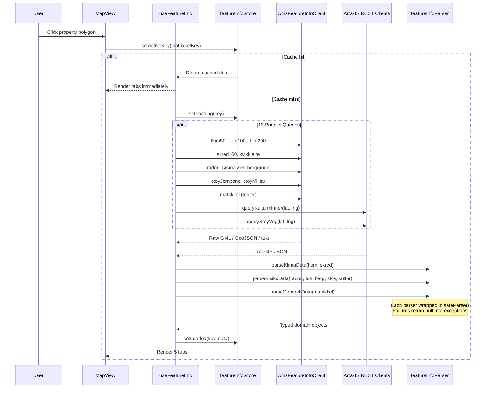

### 1.4 Batch Pre-Fetch Flow

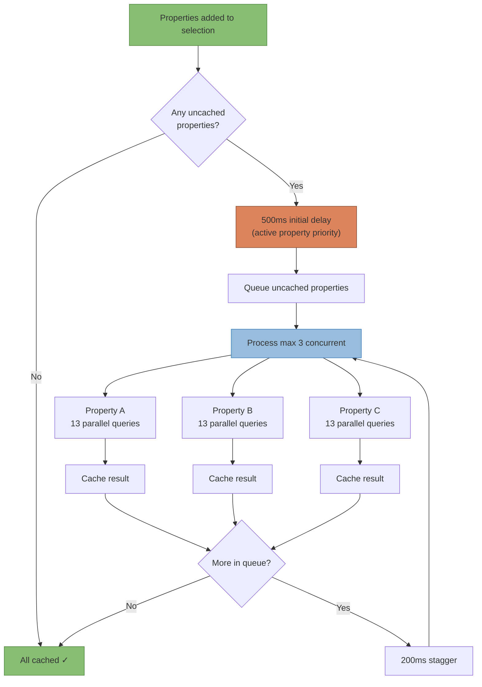

---

## 2. File Inventory

### 2.1 Directory Structure

```
src/features/map/                    # Self-contained feature module
├── MapPageView.tsx                  # Page orchestrator (~460 lines)
├── map.css                          # All map CSS (~1,850 lines)
│
├── api/                             # Pure TS HTTP clients
│   ├── fetchUtils.ts                # fetchJsonWithRetry, fetchTextWithRetry
│   ├── kartverketClient.ts          # Kartverket Eiendom v1
│   ├── geonorgeClient.ts            # Geonorge Adresser v1
│   ├── wmsFeatureInfoClient.ts      # Generic WMS GetFeatureInfo client
│   ├── kulturminnerClient.ts        # Riksantikvaren ArcGIS REST
│   ├── stoySonerClient.ts           # Miljødirektoratet ArcGIS REST
│   └── types.ts                     # API response type mirrors
│
├── config/                          # Configuration as data
│   ├── featureInfoEndpoints.ts      # 11 WMS endpoint definitions
│   ├── wmsLayers.ts                 # 7 WMS overlay layer definitions
│   └── wms-validation.md            # Endpoint validation documentation
│
├── domain/                          # Pure business logic (no React, no fetch)
│   ├── types.ts                     # Property, Address, SearchQuery, LatLng
│   ├── featureInfoTypes.ts          # KlimaData, RisikoData, StoyData, KulturminneData
│   ├── featureInfoParser.ts         # 15+ parsers with safeParse() wrapping
│   ├── propertyLookup.ts            # 3 search flows (address/matrikkel/click)
│   ├── propertySelection.ts         # Selection business logic
│   ├── matrikkelParser.ts           # Free-text matrikkel parsing
│   └── constants.ts                 # PROPERTY_COLOURS, matrikkelKey()
│
├── hooks/                           # React hooks (thin orchestration)
│   ├── useFeatureInfo.ts            # Single + batch GetFeatureInfo
│   ├── usePropertySearch.ts         # Search state management
│   ├── useMapInteraction.ts         # Map click → property selection
│   └── useMapExport.ts              # Export data for consuming apps
│
├── stores/                          # Zustand state containers
│   ├── propertySelection.store.ts   # Persisted (localStorage) selections
│   └── featureInfo.store.ts         # In-memory GetFeatureInfo cache
│
└── ui/                              # React components (rendering only)
    ├── MapView.tsx                   # Leaflet map, polygons, popups, layers
    ├── MapSearchControl.tsx          # Floating search bar (Leaflet control)
    ├── MapScreenshotControl.tsx      # Screenshot control (bottomleft)
    ├── SidePanel.tsx                 # Resizable tabbed panel
    ├── PropertyTable.tsx             # Property list with actions
    ├── PropertyPickerPopover.tsx     # Disambiguation for ambiguous clicks
    ├── PropertyPopupContent.tsx      # Popup card on polygon click
    ├── ActivePropertyHeader.tsx      # Shared header for analysis tabs
    ├── GenereltTab.tsx               # Matrikkel data display
    ├── KlimaTab.tsx                  # Flood + landslide + quick clay
    ├── RisikoTab.tsx                 # Radon + geology
    ├── MiljoTab.tsx                  # Cultural heritage + noise
    ├── StatusRow.tsx                 # Pass/warn/fail indicator component
    ├── TabEmptyState.tsx             # "Select a property" placeholder
    ├── mapEffects.tsx                # MapClickHandler, FlyTo, FitBounds, etc.
    ├── mapUtils.ts                   # geoJsonToLeafletPositions, faLocationIcon
    └── leaflet-simple-map-screenshoter.d.ts  # Type declarations
```

### 2.2 External Dependencies

| Package | Version | Purpose |
|---------|---------|---------|
| `react` | 19.x | UI framework |
| `react-dom` | 19.x | DOM rendering |
| `react-router-dom` | 7.x | Routing |
| `leaflet` | 1.9.4 | Map rendering |
| `react-leaflet` | 5.0.0 | React ↔ Leaflet bridge |
| `zustand` | 5.x | State management |
| `proj4` | 2.x | Coordinate projection (EPSG:25833 ↔ EPSG:4326) |
| `dom-to-image-more` | 3.x | Screenshot rendering (via screenshoter plugin) |
| `leaflet-simple-map-screenshoter` | 3.x | Map screenshot control |

### 2.3 Shared Dependencies (from `@shared/`)

| Module | Purpose |
|--------|---------|
| `shared/api/fetchUtils.ts` | `fetchJsonWithRetry`, `fetchTextWithRetry` |
| `shared/ui/toast/` | Toast notification store + container |

---

## 3. Data Model

### 3.1 Core Domain Types

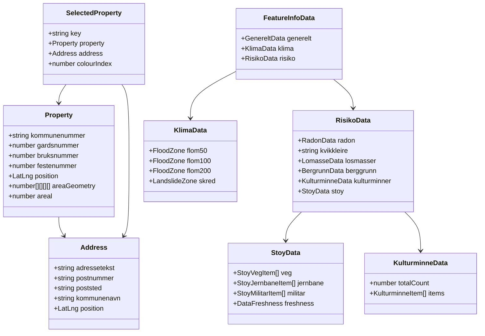

### 3.2 WMS Endpoint Configuration

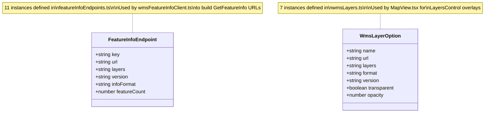

---

## 4. API Integration Details

### 4.1 WMS GetFeatureInfo Endpoints

| Key | Service | URL | Layer | Version | Format |
|-----|---------|-----|-------|---------|--------|
| `flom50` | NVE Flomsoner | `nve.geodataonline.no/...` | `Flomsone_50arsflom` | 1.3.0 | GeoJSON |
| `flom100` | NVE Flomsoner | `nve.geodataonline.no/...` | `Flomsone_100arsflom` | 1.3.0 | GeoJSON |
| `flom200` | NVE Flomsoner | `nve.geodataonline.no/...` | `Flomsone_200arsflom` | 1.3.0 | GeoJSON |
| `skred100` | NVE Skredfaresoner | `nve.geodataonline.no/...` | `Skredsoner_100` | 1.3.0 | GeoJSON |
| `kvikkleire` | NVE Kvikkleire | `nve.geodataonline.no/...` | `KvikkleireskredAktsomhet` | 1.3.0 | GeoJSON |
| `radon` | NGU RadonWMS | `geo.ngu.no/mapserver/RadonWMS2` | `Radon_aktsomhet` | 1.1.0 | GML |
| `losmasser` | NGU LosmasserWMS | `geo.ngu.no/mapserver/LosmasserWMS` | `Losmasse_flate` | 1.1.0 | GML |
| `berggrunn` | NGU BerggrunnWMS | `geo.ngu.no/mapserver/BerggrunnWMS3` | `Berggrunnsgeologi` | 1.1.0 | GML |
| `stoyJernbane` | Bane NOR | `wms.banenor.no/mapproxy/service` | `stoy` | 1.3.0 | GML |
| `stoyMilitar` | Forsvaret | `ngiswms.ngu.no/ForsvGeo/wms` | `stoyskytebane` | 1.3.0 | text/plain |
| `matrikkel` | Geonorge | `wms.geonorge.no/.../wms.matrikkelkart` | `teiger` | 1.3.0 | text/plain |

### 4.2 ArcGIS REST Endpoints

| Client | Service | URL | Query Type |
|--------|---------|-----|------------|
| `kulturminnerClient.ts` | Riksantikvaren | `gis3.ra.no/.../Kulturminner/MapServer/5` | Spatial (200m radius) |
| `stoySonerClient.ts` | Miljødirektoratet | `kart3.miljodirektoratet.no/.../stoykart_strategisk_veg/MapServer/5` | Spatial (point) |

### 4.3 Property Search APIs

| Client | API | Base URL | Auth |
|--------|-----|----------|------|
| `kartverketClient.ts` | Kartverket Eiendom v1 | `api.kartverket.no/eiendom/v1` | None |
| `geonorgeClient.ts` | Geonorge Adresser v1 | `ws.geonorge.no/adresser/v1` | None |

---

## 5. Error Handling & Resilience

### 5.1 Error Flow

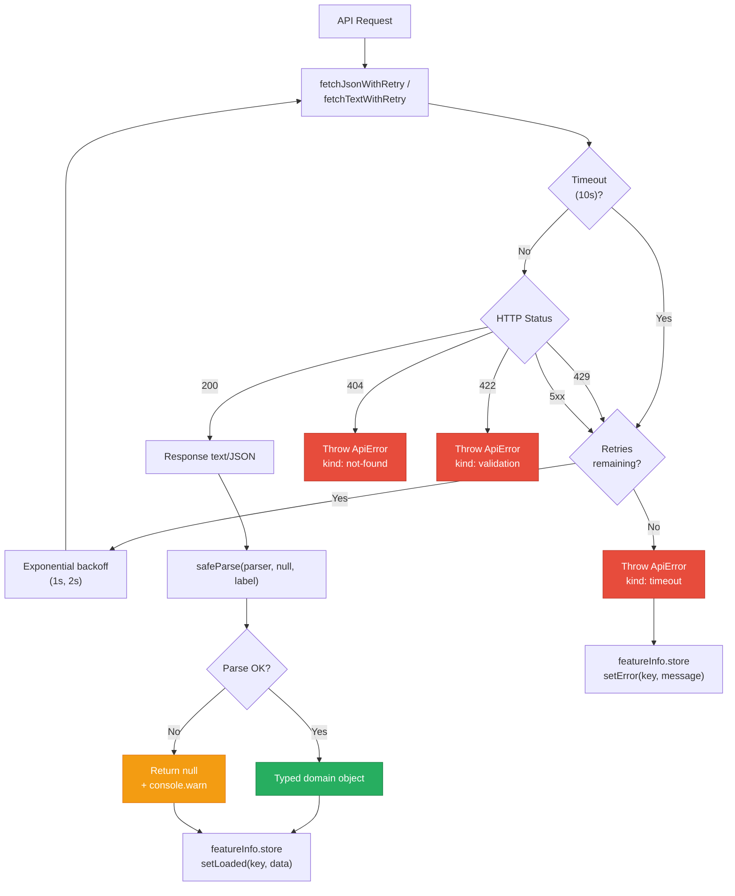

### 5.2 Resilience Patterns

| Pattern | Implementation | Purpose |
|---------|---------------|---------|
| Retry with backoff | `fetchJsonWithRetry` — 2 retries, exponential backoff | Transient network/server errors |
| Timeout | 10s per request | Prevent hanging on unresponsive WMS servers |
| SafeParse boundary | Every parser wrapped in `safeParse()` | Isolate parsing failures per-source |
| Partial success | `Promise.allSettled` style — each source independent | 10/13 sources succeeding still shows data |
| Cache | `featureInfo.store` — in-memory per matrikkel key | No redundant fetches |
| Stale detection | `DataFreshness` type with year/warning | UI warns when data may be outdated |

---

## 6. State Management

### 6.1 Store Architecture

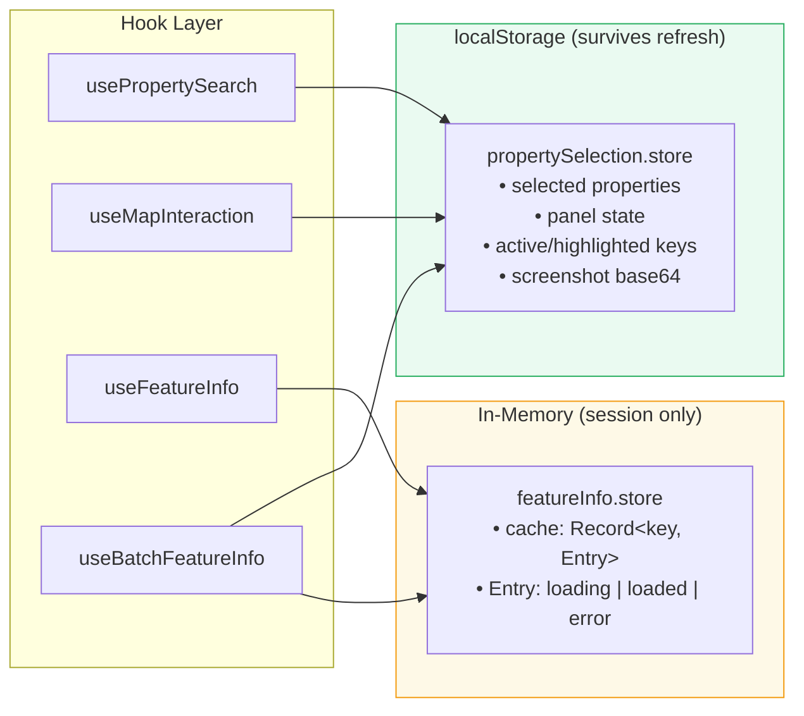

---

## 7. UI Architecture

### 7.1 Panel Layout

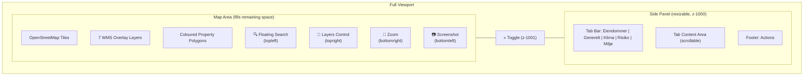

### 7.2 Tab Content Matrix

| Tab | Sections | Data Source | Status Indicators |
|-----|----------|-------------|-------------------|
| **Eiendommer** | Property table, screenshot preview | Selection store | Row highlight, colour chips |
| **Generelt** | Matrikkel attributes (18+ fields) | Geonorge WMS | Key-value pairs with Norwegian labels |
| **Klima** | Flomsone 50/100/200, Skredfare, Kvikkleire | NVE WMS | pass/warn/fail/no-data per zone |
| **Risiko** | Radon aktsomhet, Løsmasser, Berggrunn | NGU WMS | pass/warn/fail with detail text |
| **Miljø** | Kulturminner (cards), Støysoner (veg/jernbane/militær) | Riksantikvaren REST, Miljødirektoratet REST, Bane NOR WMS, Forsvaret WMS | Compact cards, freshness warnings |

---

## 8. Target Architecture — Backend + AI

### 8.1 Phase 8: Backend Extraction

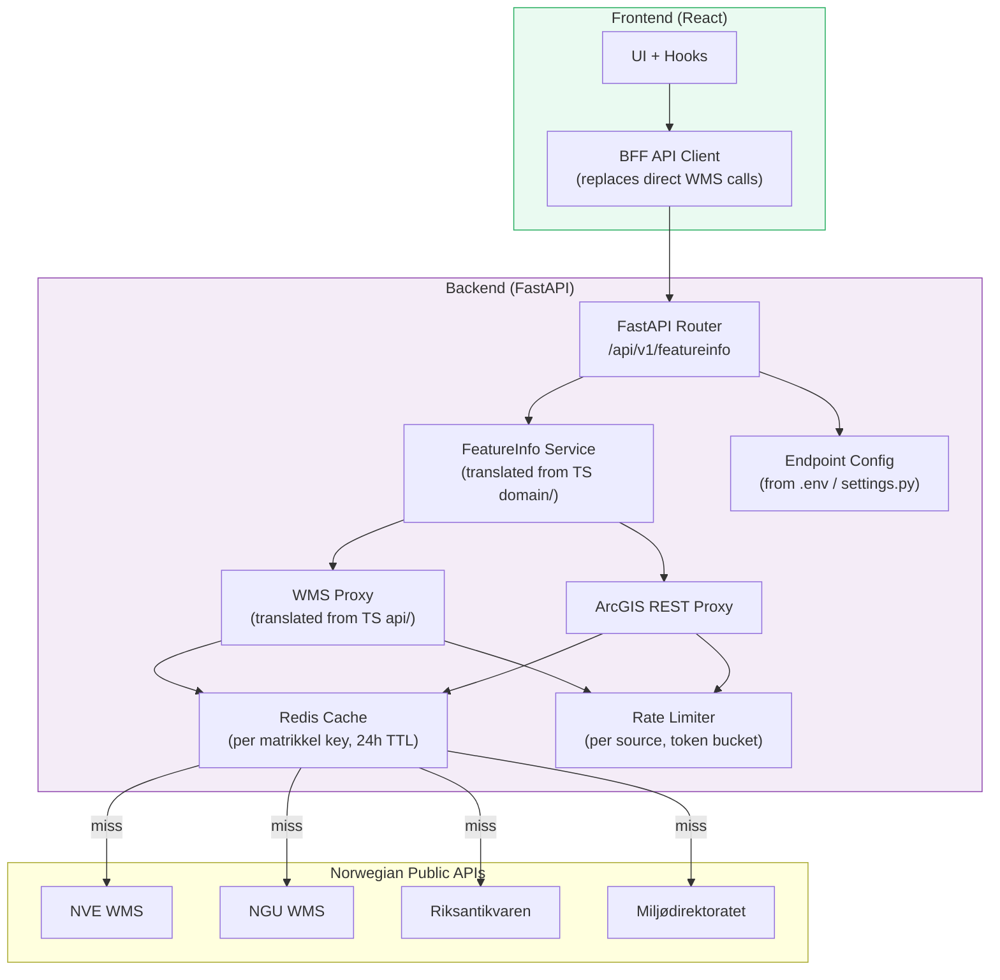

**Migration path**:
1. `api/` layer → FastAPI route handlers (1:1 translation)
2. `domain/` parsers → Python utility modules (1:1 translation)
3. `config/` → Python `settings.py` or `.env`
4. Frontend `api/` calls → single BFF endpoint (`/api/v1/featureinfo?lat=X&lng=Y`)
5. Add Redis caching, rate limiting, API key protection server-side

### 8.2 Phase 9: AI Integration

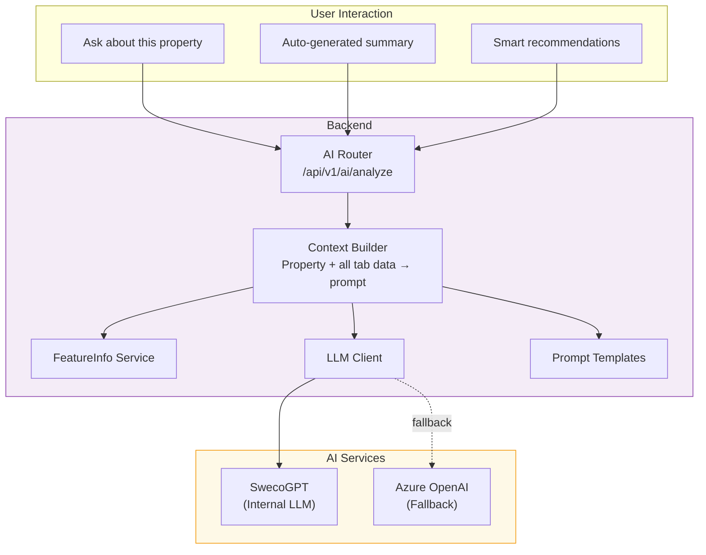

**AI capabilities** (planned):
- **F1**: "Ask about this property" — all tab data as LLM context, natural language Q&A
- **F2**: Auto-generated 2-3 sentence risk summary per property
- **F3**: Property recommendations given criteria (exploratory)

---

## 9. Risk Analysis

### 9.1 Technical Risks

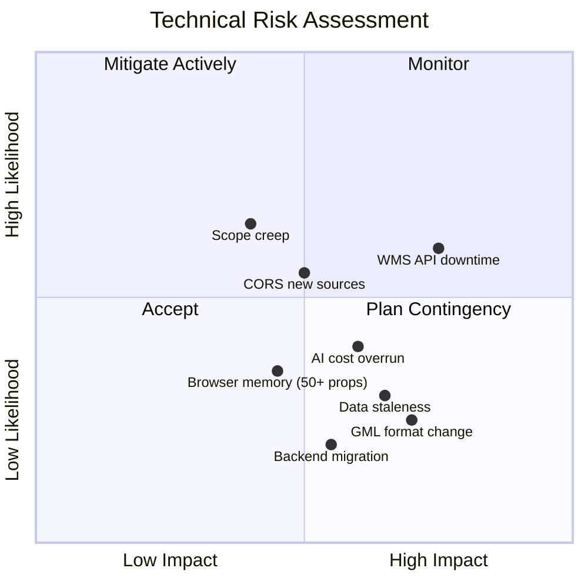

### 9.2 Risk Register

| # | Risk | Likelihood | Impact | Mitigation | Status |
|---|------|-----------|--------|------------|--------|
| R1 | WMS API downtime (NVE, NGU, etc.) | Medium | High | Retry with backoff, per-source graceful degradation, safeParse | ✅ Implemented |
| R2 | CORS restrictions on new WMS sources | Medium | Medium | Test each source upfront; backend proxy as Phase 8 fallback | ✅ Pattern established |
| R3 | Data freshness/accuracy | Low | High | DataFreshness type with year + warning display in UI | ✅ Implemented |
| R4 | Scope creep (too many data sources) | Medium | Medium | Phased approach with clear priority tiers, ADR for each change | ✅ Process in place |
| R5 | Backend extraction complexity | Low | Medium | Layer separation enforced from day 1, pure TS in api/ and domain/ | ✅ Architecture verified |
| R6 | GML/API format changes without notice | Low | High | safeParse boundaries, console warnings, fallback to null | ✅ Implemented |
| R7 | Memory usage with 50+ properties | Low | Medium | In-memory cache only (no localStorage for feature data), batch concurrency cap | ✅ Mitigated |
| R8 | AI integration cost overrun | Medium | Medium | Start with SwecoGPT (internal), prompt engineering to minimize tokens | ⬜ Future |

---

## 10. Performance Characteristics

| Metric | Value | Notes |
|--------|-------|-------|
| **Queries per property** | 13 (11 WMS + 2 REST) | All parallel via `Promise.all` |
| **Typical query time** | 800ms–2.5s | Depends on slowest WMS server |
| **Batch concurrency** | 3 properties simultaneous | 39 parallel HTTP requests max |
| **Cache hit (tab switch)** | < 50ms | In-memory Zustand store |
| **Initial page load** | ~1.5s | Leaflet tiles + stored properties restore |
| **CSS bundle** | ~1,850 lines | Single `map.css` file |
| **TypeScript files** | 40+ | Across 6 directories |

---

## 11. Deployment & Portability

### 11.1 Current Deployment

The map service deploys as part of the NO-Ask Vite SPA:
- Docker container with nginx (see `Dockerfile`, `dockerscripts/`)
- Environment config injected via `env-config.json`
- Pipeline: `pipelines/pipeline-deploy.yaml`

### 11.2 Feature Portability

The `features/map/` folder is self-contained and can be ported to another React app by:

1. **Copy** `src/features/map/` directory
2. **Copy** `src/shared/api/fetchUtils.ts` (retry utilities)
3. **Copy** `src/shared/ui/toast/` (optional — for error toasts)
4. **Install** npm deps: `leaflet`, `react-leaflet`, `zustand`, `proj4`, `dom-to-image-more`, `leaflet-simple-map-screenshoter`
5. **Wire** the route and provide CSS tokens (Sweco Tailwind or remap to target design system)

**No changes needed in** `api/`, `domain/`, `config/`, `hooks/`, or `stores/` — only CSS tokens and the route entry point.

---

## 12. Revision History

| Date | Author | Change |
|------|--------|--------|
| 2026-02-27 | NOASOL | Initial TAD creation — covers Phases 1–6 (partial) |

---

*This is a living document. It will be updated as the map service evolves through Phase 7 (reports/comparison), Phase 8 (backend extraction), and Phase 9 (AI integration).*
